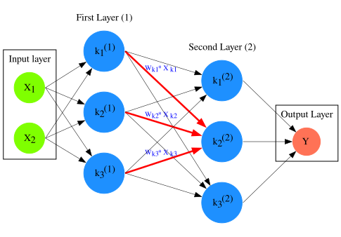

Deep Learning, a subfield of Machine Learning, has rapidly transformed the landscape of Artificial Intelligence over the past decade, achieving state-of-the-art results in areas like computer vision, natural language processing, and speech recognition.  At its core, Deep Learning leverages Artificial Neural Networks (ANNs) with multiple layers (hence “deep”) to analyze data with increasing levels of abstraction. This book will cover the foundational principles of Deep Learning, detailing the structure of ANNs, and explaining the fundamental mechanisms driving their function. We will cover how Deep Learning is the basis of modern Artificial Intelligence (AI) systems, and also explore how we achieves we achieve these remarkable capabilities, including the underlying mathematical principles.  The power of Deep Learning doesn’t reside in a single, monolithic algorithm, but rather in the flexible composition of relatively simple computational units, allowing the model to learn complex, hierarchical representations in the data.  This ability to extract data patterns and features automatically, rather than relying on curated data, is a key differentiating factor between traditional machine learning techniques and the modern Deep Learning and AI paradigm. The field is constantly evolving, but understanding these fundamental principles is essential for navigating the current research and development landscape.  We will focus on the feed-forward neural network as the basis for more complex architectures, as it is the most conceptually simple and provides a solid foundation for understanding concepts like backpropagation and gradient descent.

The intellectual origins of Deep Learning can be traced back to the mid-20th century, with early work focusing on attempts to model the biological nervous system. In 1943, Warren McCulloch and Walter Pitts proposed a simplified model of a neuron, the McCulloch-Pitts neuron, which formed the basis for early artificial neural networks.  This model, while simplistic, demonstrated that networks of these artificial neurons could, in principle, compute any arithmetic or logical function.  Frank Rosenblatt’s Perceptron (1958) was a significant step forward, an algorithm for learning a binary classifier using a single-layer neural network.  However, the Perceptron’s limitations, particularly its inability to solve  non-linearly separable problems, led to a decline in neural network research in the 1960s and 70s.  A crucial breakthrough came with the backpropagation algorithm, rediscovered in the 1980s by several researchers (though its origins can be traced back to the 1960s work of Henry J. Kelley), which provided an efficient method for training multi-layer neural networks. Despite this, the computational limitations of the time and the lack of large datasets hindered widespread adoption of artificial neural networks. 

The real resurgence of Deep Learning began in the 2000s, fueled by three key factors: the availability of massive datasets (thanks to the internet and digitization), the development of more powerful computing hardware (particularly GPUs), and algorithmic innovations like convolutional neural networks (CNNs) and recurrent neural networks (RNNs).  Geoffrey Hinton, Yoshua Bengio, and Yann LeCun are widely recognized as pioneers of Deep Learning, and their work has been instrumental in driving the field forward. The current era of Deep Learning is characterized by increasingly complex architectures, such as Transformers (which we will explore in deep detail), and a growing focus on areas like explainability, fairness, and robustness.  It is important to remember that Deep Learning is not a single algorithmic approach; it encompasses a wide range of techniques and architectures, each with its strengths and weaknesses. This requires a nuanced understanding of the underlying principles to effectively apply these technologies to real-world problems. The current era of Deep Learning is characterized by increasingly complex architectures, including Transformers which led to the immense growth of the AI field, and a growing focus on areas like explainability, fairness, and AI alignment.  

Now, let's delve into the structure and function of Artificial Neural Networks.  A typical Artificial Neural Network is inspired by the core functions of the biological neural networks in the human brain, though it is a highly simplified model. The basic building block of an ANN is the **neuron**.  Each neuron receives inputs from other neurons or from the input data at the very right (**FIG.1**), processes these inputs, and produces an output. 

====

*Figure 1.* An example *Artificial Neural Network (ANN)*. The signal
aggregation taking place on the second neuron
latexmath:[$\sigma_{k_{2}^{(2)}}$] of the second hidden layer, can be expressed
with the formula latexmath:[$\sigma_{k_{2}^{(2)}} =
\sum_{k_{1,2,3}}^{(\begin{matrix} 1 \\ \end{matrix})}w_{k1}*x_{k1} +
w_{k2}*x_{k2} + w_{k3}*x_{k3} - b$], which is the aggregation of neuron signals
from the first layer, shown as red arrows in the figure. _b_ represents the
threshold that needs to be overcome by the aggregation sum in order for the
neuron to fire, and then the neuron will transmit a signal along the line shown
towards the output on the final layer of the figure. The reader should refer to
the text for more details.
====

These neurons are organized into **layers**. A typical ANN consists of three types of layers: an **input layer**, one or more **hidden layers**, and an **output layer**. The input layer receives the raw data, the hidden layers perform intermediate computations, and the output layer produces the final prediction.  The connections between neurons in adjacent layers are represented by weights.  A **fully connected layer** (also known as a dense layer) is a layer where each neuron in one layer is connected to every neuron in the next layer.  The number of neurons in each layer is a hyperparameter that must be tuned.

Mathematically, a neuron can be described as follows: let latexmath:[x_1, x_2, ..., x_n] be the inputs to a neuron (an example with two inputs can be seen on *Fig1*). As mentioned earlier the inputs can be actual input data on the very left, or output from other neurons. Each connection between neurons is associated with a **weight** latexmath:[w_1, w_2, ..., w_n] which represents the strength of the connection between the input and the neuron. The neuron also has a **bias** term, denoted by latexmath:[b], which represents the baseline electrical signal of the biological neuron that needs to be surpassed by the input in order for the neuron to "fire". The weighted sum of the inputs is calculated as:

latexmath:[\qquad z = \sum_{i=1}^{n} w_i x_i + b]

This weighted sum, latexmath:[z], is then passed through an **activation function**, denoted by latexmath:[\sigma], to produce the output of the neuron, latexmath:[o]:

latexmath:[\qquad o = \sigma(z)]

The activation function introduces non-linearity into the model, which is crucial for learning complex patterns in the data.  Common activation functions include the sigmoid function, ReLU (Rectified Linear Unit), and tanh (hyperbolic tangent) and there many more variations.  The sigmoid function for example, defined as:

latexmath:[\qquad \sigma(z) = \frac{1}{1 + e^{-z}}]

This function squashes the output to a range between 0 and 1, making it suitable for binary classification problems.  However, it suffers from the vanishing gradient problem (explained later on). ReLU, defined as:

latexmath:[\qquad \sigma(z) = max(0, z)]

is a popular choice due to its simplicity and efficiency, but it can suffer from the "dying ReLU" problem.  The tanh function, defined as:

latexmath:[\qquad \sigma(z) = \frac{e^z - e^{-z}}{e^z + e^{-z}}]

squashes the output to a range between -1 and 1 and often performs better than the sigmoid function.

The process of learning in an ANN involves adjusting the weights and biases to minimize the difference between the predicted classification based on the input data and the true classification, which is known for the data used for training.  The adjustement of weights is typically done using an optimization algorithm called **gradient descent**, which we will also explain in detail in a different section. The key idea behind gradient descent is to iteratively update the weights and biases in the direction of the negative gradient of a **loss function**. The loss function quantifies the error between the predicted output and the actual output. Common loss functions include mean squared error (MSE) for regression problems and cross-entropy loss for classification problems. The **backpropagation algorithm** is used to efficiently compute the gradients of the loss function with respect to the weights and biases.  This is a recursive algorithm that starts at the output layer and propagates the error backwards through the network, layer by layer.  Gradient descent and backpropagation are the fundamental algorithms driving the learning process in Deep Learning. Understanding these concepts is crucial for building and training effective neural networks. 
  
∫Success with Deep Learning and training well performing artificial neural networks, lies in designing appropriate network architectures, selecting appropriate activation functions and loss functions, and tuning the hyperparameters to achieve optimal performance.
